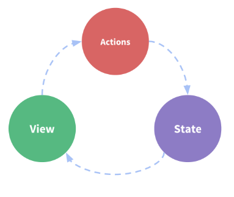
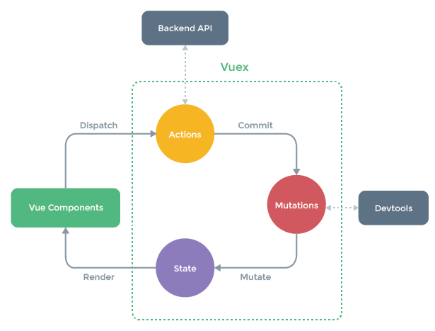
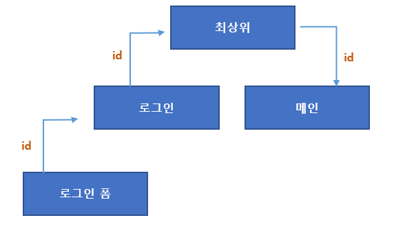
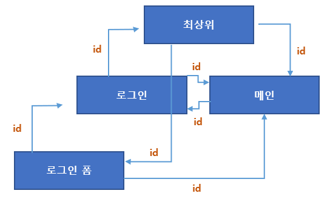

[TOC]

---

## 들어가기 전, VueX 공식문서

참고 : [vuex 공식문서](https://vuex.vuejs.org/kr/)

------

- **상태** - 앱을 작동하는 원본 소스
- **뷰** - **상태의** 선언적 매핑
- **액션** - **뷰** 에서 사용자 입력에 대해 반응적으로 상태를 바꾸는 방법

이것은 "단방향 데이터 흐름" 개념의 매우 단순한 도표이다.

그러나 **공통의 상태를 공유하는 여러 컴포넌트** 가 있는 경우 단순함이 빠르게 저하된다.

- 여러 뷰는 같은 상태에 의존한다.

  > 이 문제의 경우,  
  >
  > 1. 지나치게 중첩된 컴포넌트를 통과하는 prop는 장황할 수 있으며, 
  >
  > 2. 형제 컴포넌트에서는 작동하지 않는다. 

- 서로 다른 뷰의 작업은 동일한 상태를 반영해야 할 수 있다.

  > 이 문제의 경우, 
  >
  > 1. 직접 부모/자식 인스턴스를 참조하거나 이벤트를 통해 상태의 여러 복사본을 변경 및 동기화 하려는 등의 해결 방법을 사용해야 한다. 
  > 2. 이러한 패턴은 모두 부서지기 쉽고 유지보수가 불가능한 코드로 빠르게 변경된다.

그렇다면 컴포넌트에서 공유된 상태를 추출하고 이를 전역 싱글톤으로 관리해야 한다. 

이를 통해 우리의 컴포넌트 트리는 커다란 "뷰"가 되며 모든 컴포넌트는 트리에 상관없이 상태에 액세스하거나 동작을 트리거 할 수 있다!

또한 상태 관리 및 특정 규칙 적용과 관련된 개념을 정의하고 분리함으로써, 코드의 구조와 유지 관리 기능을 향상시킨다.

이는 Vuex의 기본 아이디어다. 다른 패턴과 달리 Vuex는 Vue.js가 효율적인 업데이트를 위해 세분화된 반응 시스템을 활용하도록 특별히 고안된 라이브러리다.

 

 

---

## VueX

- 애플리케이션 상태 관리(state management)를 돕는 라이브러리

  > **상태?**
  >
  > : 상태란, 뷰 data 속성과 비슷하다.

   

  **뷰 data속성과 '상태'는 실질적으로 어떤 차이가 있을까?**

  ex) 로그인 로직 - 컴포넌트 간 데이터 전달을 나타내는 관계도

  > id 데이터를 로그인 폼 컴포넌트 -> 메인 컴포넌트로 전달하는 관계

  

  - 로그인 폼 컴포넌트를 비롯해 모든 컴포넌트가 id 데이터(상태)를 서로 공유하고 있다.
  - 로그인 폼에서 입력받은 id를 메인에서 공유하려면, 위의 그림처럼 `로그인폼->로그인->최상위->메인`과 같이 최상위 컴포넌트를 거쳐 다시 그 최상위의 하위 컴포넌트인 메인 컴포넌트로 전달이 왼다.
  - 이 때, 그 데이터를 상태라고 한다. 즉, `id 데이터`가 `상태`가 되는 것이다.

  <b style="color:red">위의 상황에서, 만약 여러 컴포넌트가 더 늘어나게 된다면?</b>

  `props`로 데이터를 전달한다고 하면 모든 컴포넌트에 `props`를 등록해줘야한다. 만약 데이터 이름을 바꾸기라도 한다면,, 정말 손이 많이가고 관리가 상당히 어려워 질 것이다.

 

위와 같은 상황에서 `proprs`대신 이벤트 버스를 활용한다면 !?

이벤트 버스를 사용한다면, 상-하위 간 데이터 전달 구조를 따르지 않고도 한번에 로그인 폼 컴포넌트에서 메인 컴포넌트로 데이터를 보낼 수 있어 쉽게 데이터를 전달할 수 있게 된다.

다만, 여기서의 문제점은 단방향데이터 흐름이 아닌, 셀 수 없이 많은 데이터 흐름이 발생한다.

> 
>
> **데이터 흐름 규칙이 정해져 있지 않을 떄의 문제점** : 만약,, 컴포넌트가 여러개라면 이런 데이터 흐름은 배수로 늘어나 작은 애플리케이션이라해도 관리하기가 매우 힘들다.

이럴 때 필요한 것이 바로

### <b style="color:red">상태관리 </b>

이다.

애플리케이션에서 사용하는 모든 데이터를 중앙에서 관리하여 크기가 큰 애플리케이션의 데이터 관리를 효율적으로 관리하는 것이 상태 관리의 목적이다.

