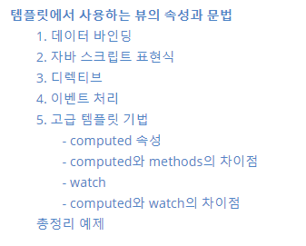
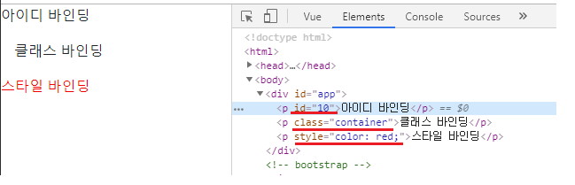
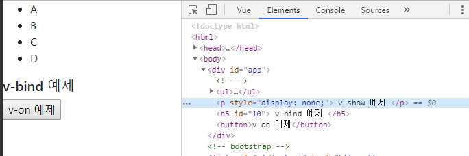
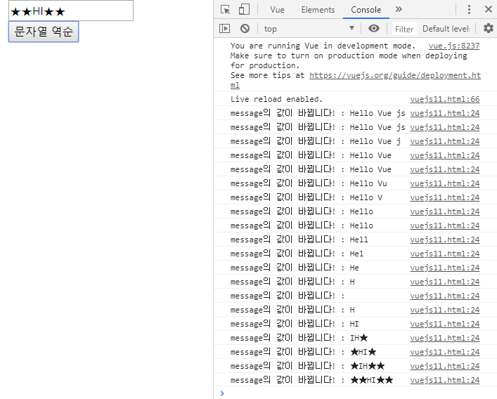

[TOC]

---



# 템플릿에서 사용하는 뷰의 속성과 문법

```
Do It! Vue.js책 99p~114p를 정리한 부분
```

---

템플릿에서 사용하는 뷰의 속성과 문법은 다음과 같다.

- 데이터 바인딩
- 자바스크립트 표현식
- 디렉티브
- 이벤트 처리
- 고급 템플릿 기법

위의 속성&문법에 대해 차례로 하나씩 살펴보겠다.

---

## 1. 데이터 바인딩

- HTML화면 요소를 뷰 인스턴스의 데이터와 연결하는 것을 의미한다.

- 주요 문법 : 1. `{{}}`, 2.`v-bind` 속성

  > 1. **`{{}}` : 콧수염 괄호**
  >
  > - `{{}}`는 <b style="background-color:yellow">뷰 인스턴스의 데이터</b>를 <b style="background-color:yellow">HTML태그에 연결</b>하는 가장 기본적인 텍스트 삽입 방식이다.
  >
  >   ex) 
  >
  >   ```html
  >   <div id="app">
  >       {{message}}
  >   </div>
  >   
  >   <script>
  >   	new Vue({
  >           el: '#app',
  >           data: {
  >               message: 'Hello Vue.js!'
  >           }
  >       });
  >   </script>
  >   ```
  >
  >   위의 코드에서 뷰 인스턴스 data속성의 message속성 값인 'Hello Vue.js!'를 
  >
  >   div태그 안의 {{message}}에 연결하여 화면에 나타내는 코드이다.
  >
  > - 만약 뷰 데이터가 변경되어도 값을 바꾸고 싶지 않다면 `v-once`속성을 사용해야한다.
  >
  >   ex)
  >
  >   ```html
  >   <div id="app" v-once>
  >       {{message}}
  >       <p>{{ sayHello() }}</p>
  >   </div>
  >   
  >   <script>
  >       new Vue({
  >           el: '#app',
  >           data: {
  >               message: 'Hello Vue.js!!'
  >           },
  >           methods: {
  >               sayHello: function () {
  >                   this.message = "안녕 뷰제이에스?"
  >                   return this.message
  >               }
  >           }
  >       });
  >   </script>
  >   ```
  >
  >   `v-once` 디렉티브를 삽입하면 `{{message}}`는 변경되기 전의 `Hello Vue.js!!`가 출력된다.
  >
  >   이와 같이 `v-once`는 HTML코드로 출력이 된 이후에 어떤 후처리가 있어도 처음에 출력한 값을 유지시킬 때 사용한다.
  >
  > <br>
  >
  > 2. **`v-bind`속성**
  >
  > - `v-bind`는 아이디, 클래스, 스타일 등의 <b style="background-color:yellow">HTML 속성 값에 뷰 데이터 값</b>을 <b style="color:red">연결</b>할 때 사용하는 데이터 연결방식이다.
  >
  > - 형식 : `v-bind`속성으로 지정할 HTML속성이나 props속성 앞에 접두사로 붙인다.
  >
  > - `v-bind`는 `:`로 축약할 수 있다. 하지만 가급적 `v-bind`속성을 이용하는 것이 좋다.
  >
  >   ex) 예제
  >
  >   ```html
  >   <div id="app">
  >       <p v-bind:id="idA">아이디 바인딩</p>
  >       <p v-bind:class="classA">클래스 바인딩</p>
  >       <p :style="styleA">스타일 바인딩</p>
  >   </div>
  >   
  >   <script>
  >       new Vue({
  >           el: '#app',
  >           data: {
  >               idA: 10,
  >               classA: 'container',
  >               styleA: 'color:red'
  >           }
  >       });
  >   </script>
  >   ```
  >
  >   위의 코드를 실행했을 때, 데이터의 값이 각 태그에 연결되어 화면에 나타난다.
  >
  >   
  >
  >   

<br>

------

## 2. 자바 스크립트 표현식

- 뷰의 템플릿에서도 자바스크립트 표현식을 사용할 수 있다.

- 사용법 : 데이터 바인딩 방법 중 하나인 `{{}}`안에 자바스크립트 표현식을 넣으면 된다.

  > ex)
  >
  > ```html
  > <div id="app">
  >     <p>{{ message }}</p>
  >     <p>{{ message + "!!!!" }}</p>
  >     <!-- 자바스크립트 내장 API 사용 -->
  >     <p>{{ message.split('').reverse().join('') }}</p>
  > </div>
  > <script>
  >     new Vue({
  >         el: '#app',
  >         data: {
  >             message: 'Hello Vue js ♡'
  >         }
  >     });
  > </script>
  > ```
  >
  > 출력 
  >
  > ```
  > Hello Vue js ♡
  > 
  > Hello Vue js ♡!!!!
  > 
  > ♡ sj euV olleH
  > ```

- <b style="color:red">자바스크립트 표현식에서 주의할 점!</b>

  1. 자바 스크립트의 선언문과 분기 구문은 사용할 수 없다. -> 삼항 연산자는 사용 가능!

     ex)

     ```html
     <!-- 주의할 점 ! -->
     <div id="app">
         <!-- 선언문 불가능! -->
         <!--{{ var a = 10; }}-->
         
         <!-- 분기 구문 사용 불가능!-->
         <!--{{ if(true) {return 100} }-->
         
         <!-- 삼항 연산자 사용 가능 -->
         {{ true? 100:0 }}
     
     </div>
     ```

  2. 복잡한 연산은 인스턴스 안에서 처리하고 화면에는 간단한 연산 결과만 표시해야한다.

     ex)

     ```html
     <!-- 주의할 점 ! -->
     <div id="app">
         <!-- 복잡한 연산은 인스턴스 안에서 수행! 
     		아래의 코드는 코드 가독성이 떨어지기에 사용하지 않는 것이 좋음
     	-->
         <p>{{ message.split('').reverse().join('') }}</p>
         
         <!-- 스크립트에서 computed 속성으로 계산 후 최종값만 표현-->
         {{ reversedMessage }}
     </div>
     
     <script>
         new Vue({
             el: '#app',
             data: {
                 message: 'Hello Vue js ♡'
             },
             computed:{
                 reversedMessage : function(){
                     return this.message.split('').reverse().join('');
                 }
             }
         });
     </script>
     ```


<br>

------

## 3. 디렉티브

- 뷰 디렉티브란, HTML태그 안에 `v-접두사`를 가지는 모든 속성들을 의미한다.

- 디렉티브는 화면의 요소를 더 쉽게 조작하기 위해 사용하는 기능이다.

- 뷰의 데이터 값이 변경되었을 때 화면의 요소들이 리액티브하게 반응하여 변경된 데이터 값에 따라 갱신된다.

- **사용예시**

  ex) `<a v-if="flag"> a태그 </a>` : 뷰 인스턴스 데이터 속성의 `flag`값에 따라 a태그가 보이기도, 안보이기도 한다.

- **자주 사용하는 주요 디렉티브**

  | 디렉티브 이름 | 역할                                                         |
  | ------------- | ------------------------------------------------------------ |
  | v-if          | - 지정한 뷰 데이터 값의 참, 거짓 여부에 따라 <br>   해당 HTML태그를 화면에 표시하거나 표시하지 않는다.<br>- <b style="color:red">해당 데이터를 완전히 삭제</b>한다. |
  | v-for         | 지정한 뷰 데이터의 개수만큼 해당 HTML태그를 반복 출력한다.   |
  | v-show        | v-if와 유사하지만, v-show는 css효과만 `display:none;`으로 적용한다. |
  | v-bind        | HTML태그의 기본 속성과 뷰 데이터 속성을 연결한다.            |
  | v-on          | 화면 요소의 이벤트를 감지하여 처리할 때 사용한다.<br>**ex)** `v-on:click`은 해당 태그의 클릭 이벤트를 감지해 특정 메소드를 실행한다. |
  | v-model       | - 폼(form)에서 주로 사용되는 속성이다.<br>- 폼에 입력한 값을 뷰 인스턴스의 데이터와 즉시 동기화한다.<br>- 화면에 입력된 값을 저장해 서버에 보내거나, <br>   watch와 같은 고급 속성을 이용해 추가 로직을 수행할 수 있다.<br>- `<input>, <select>, <textarea>` 태그에만 사용할 수 있다. |

- **ex) 예제코드**

  ```html
  <div id="app">
      <!-- v-if 예제 -->
      <a v-if="flag"> v-if 예제 </a>
  
      <!-- v-for 예제 -->
      <ul>
          <li v-for="system in systems">{{system}}</li>
      </ul>
  
      <!-- v-show 예제 -->
      <p v-show="flag"> v-show 예제 </p>
  
      <!-- v-bind 예제 -->
      <h5 v-bind:id="uid"> v-bind 예제 </h5>
  
      <!-- v-on 예제 -->
      <button v-on:click="popupAlert">v-on 예제</button>
  </div>
  <script src="https://cdn.jsdelivr.net/npm/vue@2.5.2/dist/vue.js"></script>
  <script>
      new Vue({
          el: '#app',
          data: {
              flag: false,
              systems: ['A', 'B', 'C', 'D'],
              uid: 10
          },
          methods:{
              popupAlert: function(){
                  return alert("!!!!");
              }
          }
      });
  </script>
  ```

  **v-if와 v-show의 차이**

  

<br>

------

## 4. 이벤트 처리

- 뷰는 화면에서 발생한 이벤트 처리를 위해 `v-on`디렉티브와 `methods`속성을 활용한다.

  ex)

  ```html
  <div id="app">
      <!-- v-on:click 예제 -->
      
      <button v-on:click="clickBtn()">click!</button><hr>
      <!-- 인자 전달 -->
      <button v-on:click="clickBtn2(10)">click!</button><hr>
      
      <!-- 화면요소의 돔 이벤트 접근 -->
      <button v-on:click="clickBtn3">click!</button><hr>
  </div>
  <script src="https://cdn.jsdelivr.net/npm/vue@2.5.2/dist/vue.js"></script>
  <script>
      new Vue({
          el: '#app',
          methods:{
              clickBtn : function(){
                  alert("click !!!");
              },
              clickBtn2 : function(num){
                  alert('click : ' + num);
              },
              clickBtn3 : function(event){
                  console.log(event);
              }
          }
      });
  </script>
  ```

<br>

------

## 5. 고급 템플릿 기법

### - computed 속성

- 데이터들을 정의하는 영역

- 장점 1 - data 속성값의 변화에 따라 자동으로 다시 연산한다. computed 속성에서 사용하고 있는 data 속성값이 변경되면 전체 값을 다시 한번 계산한다.

  장점 2 - 캐싱, 연산의 결과 값을 미리 저장하고 있다가 필요할 때 불러온다.

- 복잡한 연산을 반복해서 화면에 나타내야 한다면 methods모다 성능면에서 효율적이다.

### - computed와 methods의 차이점

- methods속성은 캐싱 X, computed속성은 데이터가 변경되지 않는 한 이전의 계산 값을 캐싱하고 필요할 때 바로 반환해준다.

- methods : 수동적 데이터 갱신 - 호출할 때만 해당 로직이 수행됨

  computed: 능동적 데이터 갱신 - 대상 데이터 값이 변경되면 자동으로 수행한다.

  **ex) 예제**

  ```html
  <div id="app"  class="container">
      <p v-once>{{message}}</p>
      <p>{{message}}</p>
      <p>{{ reversedMessage }}</p>
      <button v-on:click="reverseMsg">문자열 역순</button>
  </div>
  <script src="https://cdn.jsdelivr.net/npm/vue@2.5.2/dist/vue.js"></script>
  <script>
      new Vue({
          el: '#app',
          data: {
              message: 'Hello Vue js !'
          },
          computed:{
              reversedMessage : function(){
                  return this.message.split('').reverse().join('');
              }
          },
          methods:{
              reverseMsg: function(){
                  this.message = this.message.split('').reverse().join('') + "★";
                  return this.message;
              }
          }
      });
  </script>
  ```

  > 위의 코드에서 methods속성일 경우 버튼을 클릭했을 때만 적용이 되지만, 
  >
  > computed속성에서는 message의 변경이 있을 때 마다 새로 데이터를 갱신한다.

### - watch

- watch속성은 데이터 변화를 감지하여 자동으로 특정 로직을 수행한다.

### - computed와 watch의 차이점

- computed : 내장 API를 활용한 간단한 연산 정도로 적합
- watch : 데이터 호출과 같이 시간이 상대적으로 더 많이 소모되는 비동기 처리에 적합

**ex) 예제**

```html
<div id="app"  class="container">
    <input v-model="message">
    <button v-on:click="reverseMsg">문자열 역순</button>
</div>
<script src="https://cdn.jsdelivr.net/npm/vue@2.5.2/dist/vue.js"></script>
<script>
    new Vue({
        el: '#app',
        data: {
            message: 'Hello Vue js !'
        },
        watch:{
            message: function(data){
                console.log("message의 값이 바뀝니다! : " + data )
            }
        },
        computed:{
            reversedMessage : function(){
                return this.message.split('').reverse().join('');
            }
        },
        methods:{
            reverseMsg: function(){
                this.message = this.message.split('').reverse().join('') + "★";
                return this.message;
            }
        }
    });
</script>
```



---


<br>

## 총정리 예제

```html
<div id="app">
    <header>
        <h3>
            {{ message }},
            <!-- #1. 새로 추가한 데이터 속성을 아래에 추가 --><br>
            {{ myName }}
        </h3>
    </header>
    <section>
        <!-- #2. uid 값을 변경한 후 크롬 개발자 도구의 '요소 검사' 기능으로 아래 p 태그의 id 값 확인 -->
        <p v-bind:id="uid"></p>

        <button v-on:click="hiConsole">HI Console</button>
        <!-- 위 코드와 아래 코드는 동일한 역할을 수행. v-on:를 간소화한 문법은 @ -->
        <!-- <button @click="clickBtn">alert</button> -->

        <!-- #3. button 태그를 추가하고 새로 추가한 클릭 메서드를 연결 -->
        <button v-on:click="hiAlert">HI Alert</button>

        <!-- #4. 데이터의 flag 속성 값의 변화에 따라 아래 내용이 어떻게 변하는지 확인 -->
        <ul v-if="flag">
            <li>1</li>
            <li>2</li>
            <li>3</li>
        </ul>

        <ul v-show="flag">
            <li>ONE</li>
            <li>TWO</li>
            <li>THREE</li>
        </ul>
    </section>
</div>
<script>
    var app = new Vue({
        el: '#app',
        data: {
            message : 'Hello Vue.js',
            // 할 일 #1
            // 새로운 데이터 속성을 1개 추가하고, 머스타쉬 {{ }} 데이터 바인딩을 이용하여 화면에 표시해보세요.
            myName : "Jalynne",

            uid: '10',
            // 할 일 #2
            // uid를 변경하고 해당 uid의 변경 여부를 크롬 개발자 도구의 '화면 요소 검사 기능'으로 확인해보세요. p 태그의 id 값을 검사.
            uid: '20',
            flag: true
            // 할 일 #4
            // 위 flag 값을 false로 변경했을 때 화면에 어떤 영향을 주는지 확인해보세요.
        },
        methods: {
            // ES6 문법
            hiConsole() {
                console.log("hi");
            },
            // ES5 문법 - 위 ES6 문법과 동일한 코드
            // clickBtn: function() {
            //   console.log("hi");
            // }


            // 할 일 #3
            // eventMethod를 하나 추가하고 index.html의 #3 영역에 해당 이벤트를 실행하는 버튼을 추가하세요.
            hiAlert(){
                alert("HI!");
            }
        }
    });
</script>
```


