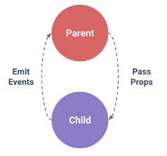

참고자료

https://joshua1988.github.io/web-development/vuejs/vuejs-tutorial-for-beginner/?source=post_page-----f0609a7756b7----------------------#vue-templates

---

[TOC]

---

#### 부모와 자식 컴포넌트 관계

컴포넌트 관계도에서 상-하 관계에 있는 컴포넌트의 통신은

- 위에서 아래로는 데이터(props)를 내리고
- 아래에서 위로는 이벤트를 올린다(event emit)



#### Props - [코드보기]()

프롭스는 상위 컴포넌트에서 하위 컴포넌트로 **내리는 데이터 속성**을 의미한다. 

이렇게 하는 이유는 모든 컴포넌트가 각 컴포넌트 자체의 스코프를 갖고 있어 다른 컴포넌트의 값을 바로 참조할 수 없기 때문이다.

> **주의할 점: props 변수 명을 카멜 기법(aBow)으로 정의하면 html 태그에서 사용할 때는 케밥 기법(-)으로 선언해야 한다.**
>
> ex)
>
> ```html
> <div id="app" class="container">
>     <!--  
> 		html 태그에서 사용할 때는 케밥 기법(-)으로 선언 
> 		아래 선언을 v-bind:isPropsdata로 하면 인식 못함
> 	-->
>     <child-component v-bind:is-propsdata="message"></child-component>
> </div>
> 
> <script>
>     Vue.component('child-component', {
>         // props 변수 명을 카멜 기법(aBow)으로 정의하면
>         props: ['isPropsdata'],
>         template: '<p>{{ isPropsdata }}</p>'
>     });
> 
>     var app = new Vue({
>         el: '#app',
>         data: {
>             message: 'Hello Vue! from Parent Component',
>         }
>     });
> </script>
> ```

<br>

---

#### 같은 레벨의 컴포넌트 간 통신

동일한 상위 컴포넌트를 가진 하위 컴포넌트들 간의 통신은 아래와 같이 해야 한다.

- Child(하위) -> Parent(상위) -> Children(하위 2개)

**참고 : 컴포넌트 간의 직접적인 통신은 불가능하도록 되어 있는게 Vue 의 기본 구조**


